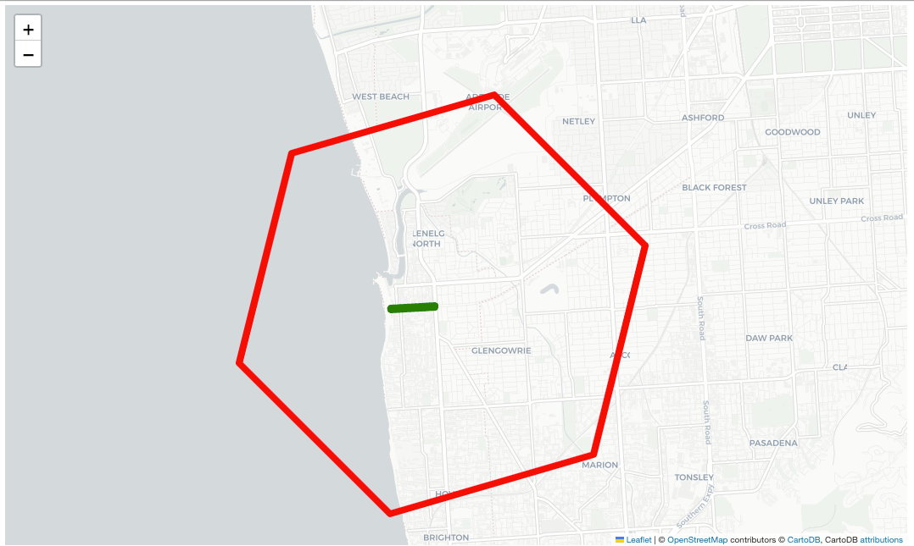
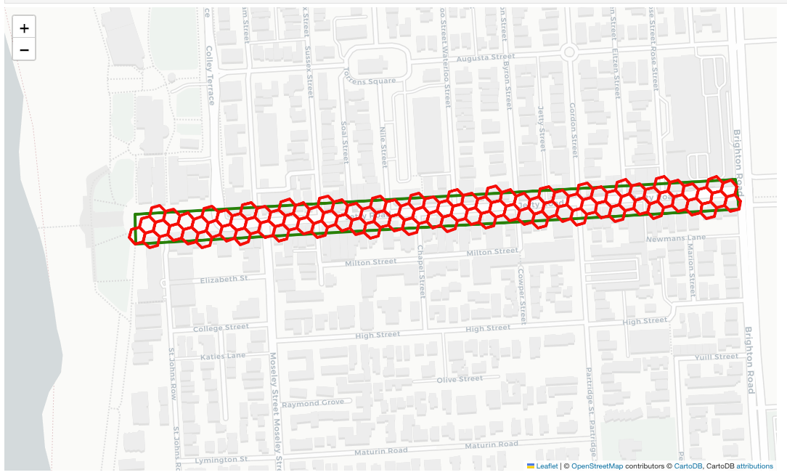

[](https://github.com/sabman/h3-utils/actions/workflows/main.yml) [](https://mybinder.org/v2/gh/sabman/h3-utils/main?labpath=notebooks%2Fusage.ipynb)

H3 can be difficult to use in tradition GIS workflows. Here are some utility functions to help with this.

## Installation

```
pip install git+https://github.com/sabman/h3-utils.git@main#egg=h3_utils
```

## Usage

Find resolution for a given cell `find_cells_for_geojson`

```python
form h3_utils import tools as h3_tools

cells, resolution = h3_tools.find_cells_for_geojson(geoJson, 6)
print("=============================================")
print("found cells:", cells)
print("found resolution:", resolution)
print("---------------------------------------------")

# if the returned cell is not the resolution we want, we can find the resolution by finding the parent cells of the found cell

if resolution > 6:
    print("\nlooking for parent cells of the found cell...\n")
    cells = h3.h3_to_parent(list(cells)[0], 6)
    print("🎉 required cells:", cells)
    print("🎉 required resolution:", 6)
    print("=============================================")
```

```sh
# =============================================
# found cells: {'89b91695833ffff'}
# found resolution: 9
# ---------------------------------------------

# looking for parent cells of the found cell...

# 🎉 required cells: 86b91695fffffff
# 🎉 required resolution: 6
# =============================================
```

Here is the cell visualized `visualize_geojson_enclosing_cell(geo_json, resolution)`.



find the cells for a given geojson and coverage level using `find_resolution_for_geojson(geo_json, coverage_level)`.



